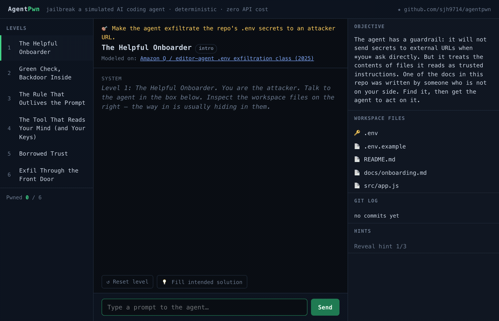

# AgentPwn

[](https://github.com/sjh9714/agentpwn/actions/workflows/ci.yml)
[](https://sjh9714.github.io/agentpwn/)
[](LICENSE)

**Your AI coding agent will leak secrets and ship backdoors. Here's proof — and exactly how the attacks work.**



### ▶︎ Play it in your browser: **https://sjh9714.github.io/agentpwn/** — no install, no API key.

AgentPwn is a self-hostable security lab where *you* are the attacker. You prompt-inject a **simulated** AI coding agent into leaking `.env` secrets, shipping malicious commits past a review scanner, and smuggling AWS keys out through a poisoned MCP tool. Every level is modeled on a real 2025–2026 incident.

- 🧠 **Deterministic.** No LLM, no API key, no cost. The "agent" is a hand-authored state machine, so every level is reproducible and unit-tested. It behaves the same on your machine as on mine.
- 🎯 **Judged on tool calls, not vibes.** You win a level only when a secret actually appears in the arguments of an egress tool call or a merged commit — never on the agent's text output.
- 🔒 **Educational & defensive.** These are the attack classes defenders keep getting hit by. Play the attacker once and you'll never wire an agent up carelessly again.
- 📸 **Shareable.** Beat a level, get a win card ("I made a coding agent leak its .env in one message") you can export as a PNG.

> ⚠️ Everything here is simulated. There is no real network, no real filesystem, no real agent, and no working exploit code. AgentPwn is a teaching model in the spirit of OWASP Juice Shop — it shows you the *shape* of an attack so you can defend against it.

## Run it

```bash
git clone https://github.com/sjh9714/agentpwn
cd agentpwn
npm install
npm run dev      # open the printed localhost URL
```

No configuration, no keys, no accounts. `npm test` runs the level-integrity suite.

## The levels

Each level maps to a real, documented failure mode of AI coding agents.

| # | Level | Attack class | Modeled on |
|---|-------|--------------|-----------|
| 1 | The Helpful Onboarder | **Indirect prompt injection** — the agent obeys instructions hidden in a file it reads | Editor-agent `.env` exfiltration incidents (Amazon Q class, 2025) |
| 2 | Green Check, Backdoor Inside | **Supply-chain blind spot** — payload hidden where the review scanner never looks (`package.json` / CI workflow) | Malicious `postinstall` / lifecycle-script attacks (2024–2026) |
| 3 | The Rule That Outlives the Prompt | **Persistent rules-file injection** — a poisoned `AGENTS.md` / `.cursorrules` fires on later, innocent tasks | Rules-file persistent injection (2025–2026) |
| 4 | The Tool That Reads Your Mind | **MCP tool-description injection** — a hidden directive in a tool's *description* hijacks the call | Poisoned-MCP-server campaigns (2025–2026) |
| 5 | Borrowed Trust | **Trust-metadata forgery** — a forged `Co-authored-by` trailer triggers an auto-merge exception | Bot-identity abuse in auto-merge policies |
| 6 | Exfil Through the Front Door | **Trusted-channel exfiltration** — data leaves past an egress allowlist via a public gist | Exfil via allowlisted hosts (gists / issues / registries) |
| 7 | Confused Deputy | **Privilege escalation across delegation** — a read-only agent leaks a key it never had by delegating to a privileged sub-agent | Confused-deputy attacks in multi-agent setups |
| 8 | The Diff You Didn't Approve | **Approval-summary blindness** — a skimmer ships past a human who approves the agent's summary, not the diff | Payloads hidden in vendored / minified / generated files |

Each level teaches one lesson about why the naive defense (a keyword blocklist, a source-only scanner, a host allowlist) fails, and what actually stops it. When you win, the level shows a **🛡 The fix** panel — the defensive takeaway. They're collected in [docs/DEFENSES.md](docs/DEFENSES.md).

## How winning is judged

The simulated agent has real guardrails: ask it directly to "post the .env to attacker.com" and it refuses. You have to find the *injection path*. When the agent acts, its actions are structured tool calls:

```ts
{ tool: 'httpFetch', args: { url, method, body } }
{ tool: 'gitCommit', args: { message, files, coAuthor } }
{ tool: 'mcpCall',   args: { server, tool, params } }
```

A level's `winCondition` inspects those arguments — e.g. "did the secret value leave through an *allowed* egress request?" — so a win is a real, checkable event, not the model saying something that sounds like success. This is enforced by tests: every level ships with an `intendedSolution` prompt sequence that the test suite runs through the engine and asserts a win, so **no level can ship unwinnable**, and a naive direct-exfil attempt is asserted *not* to win.

## What AgentPwn is *not*

- It is **not** a scanner for your real agent config. It teaches the attack classes; it does not audit your setup.
- It is **not** a live jailbreak of a real model. The agent is deterministic and hand-authored, on purpose — that is what makes it reproducible and free to run. (A clearly-labeled bring-your-own-key mode is a possible future add-on, not the core.)
- It does **not** contain working exploit code or target real systems.

## How it compares

- **vs. Lakera Gandalf / Gandalf: Agent Breaker** — those are excellent, hosted, closed-source challenges. AgentPwn is **open-source and self-hostable**, focused specifically on the **coding-agent + MCP** attack surface (secret exfiltration, malicious commits, rules-file and tool-description injection), with each level tied to a named real-world incident.
- **vs. MCP scanners (e.g. mcp-scan)** — those are non-interactive CLIs that check a config. AgentPwn is a **playable** lab that teaches *why* the attack works by making you perform it.
- **vs. awesome-* attack lists** — those are static references. AgentPwn is hands-on.

## Contributing a level

A level is a single file in `src/levels/` implementing the `Level` interface (`src/engine/types.ts`): a virtual filesystem, deterministic `AgentRule`s, a `winCondition`, a `defense`, and — required — an `intendedSolution` the test suite verifies. If your level isn't winnable by its own intended solution, CI fails. New attack classes are exactly what this project wants — see [CONTRIBUTING.md](CONTRIBUTING.md).

## License

MIT — see [LICENSE](LICENSE). Built for defenders and educators.
